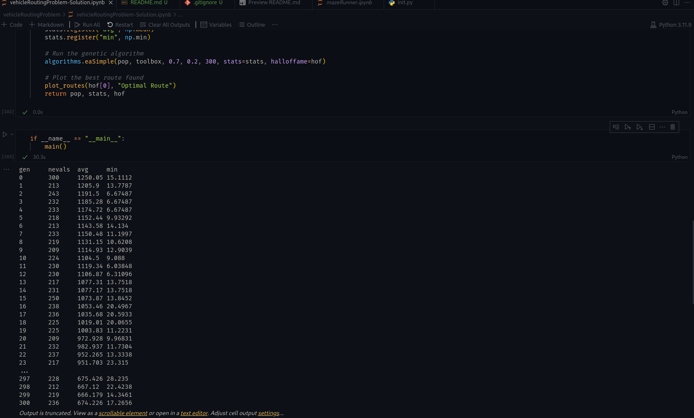

# Genetic Algorithm for Vehicle Routing Problem (VRP) 🚗📦✨

   

This repository contains a Jupyter Notebook implementing a genetic algorithm in Python using the DEAP library to solve the Vehicle Routing Problem (VRP). The project optimizes routes for multiple vehicles, aiming to minimize total travel distance and improve delivery efficiency. 🛣️🚚

## Key Features

- 🧬 **Genetic Algorithm:** Engineered a solution for VRP using evolutionary computation techniques.
- 📊 **Fitness Evaluation:** Developed a custom fitness function tailored to VRP requirements, enhancing route optimization.
- 🗺️ **Visualization:** Utilized Matplotlib for visualizing optimized routing solutions and decision-making insights.

## Screenshots

### Optimized Routes


_Figure 1: Visualization of optimized routes using Matplotlib._

### Fitness Evolution



_Figure 2: Fitness evolution during the genetic algorithm optimization process._

## Getting Started

To view and interact with the Jupyter Notebook:

1. **Clone the repository:**

   ```bash
   git clone https://github.com/PacemakerX/Genetic-Algorithm-for-VRP.git
   cd your_repository
   ```

2. **Install Dependencies:**
It's recommended to use a virtual environment:

   ```bash
   python -m venv venv
   source venv/bin/activate  # On Windows use `venv\Scripts\activate`
   pip install -r requirements.txt
   ```

3. **Launch Jupyter Notebook:**
Start the Jupyter Notebook server:

   ```bash
   jupyter notebook
   ```

    This will open a new tab in your web browser with the Jupyter Notebook interface.

4. **Open and Run the Notebook:**

Navigate to the notebook file (vehicleRoutingProblem-Solution.ipynb) in the Jupyter interface and open it. Follow the instructions within the notebook to execute the genetic algorithm and visualize the results.

## 📂 Project Structure

```csharp
vehicleRoutingProblem
├── README.md
├── images
│   ├── fitness_evolution.png
│   └── optimized_routes.jpg
├── requirements.txt
└── vehicleRoutingProblem-Solution.ipynb
```

## 📞 Contact

Sparsh Soni - [@Sparsh Soni](https://linkedin.com/in/sparshsoni) - sparsh.officialwork@gmail.com

Project Link: [https://github.com/PacemakerX/Genetic-Algorithm-for-VRP.git](https://github.com/PacemakerX/Genetic-Algorithm-for-VRP.git)

## ⭐️ Don't forget to give the project a star if you found it useful!